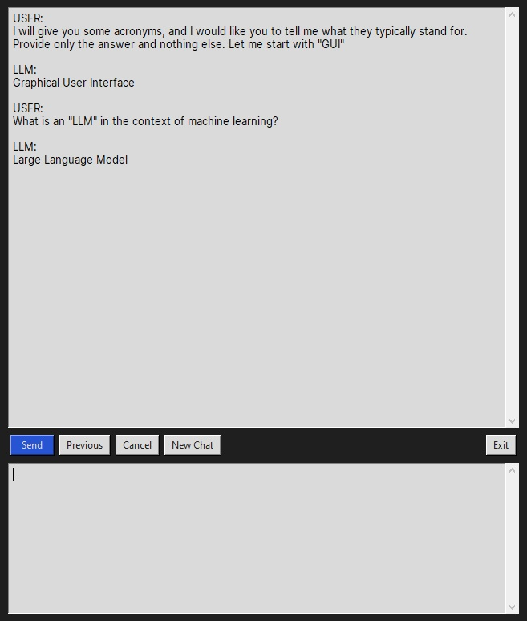

# Basic LLM GUI

A simple GUI written in Python for chatting with large language models locally using [Ollama](https://github.com/ollama/ollama).

Below is an example of a short chat with the 8B variant of [Meta Llama 3](https://ollama.com/library/llama3):

# How to Install

Assuming you have Python 3.8+ installed:

1. Install the required Python packages
   - `pip install requests ollama`
   - The remaining packages should be part of the base library
2. Install and run [Ollama](https://ollama.com/)
3. Download [Llama 3](https://ollama.com/library/llama3) by opening the command line and running
   - `ollama pull llama3`
4. Make sure that Ollama is running, then start `llm_gui.py` and chat!

Lastly, Windows users may use the `Start GUI.bat` script, which first starts Ollama with the Llama 3 model and then runs `llm_gui.py` to start the GUI.

# How to Use

Write into the bottom text box and click **Send** (or `Ctrl + Enter`). The first prompt may take a while since the model will be loading in the background. After that, you should see a stream of answers from the LLM.

The **Previous** button returns the last message/query sent by the user.

The **Cancel** button interrupts the response of the LLM.

The **New Chat** button resets history and starts a brand new chat session.

The **Exit** button exits the GUI (or simply close out the window).

# To-do

- [x] Cancel / interrupt the LLM while an answer is being generated
- [x] Start a new chat / reset
- [x] Improve stability
- [ ] Custom button design

# License

This project is licensed under the [MIT License](https://github.com/rnd195/basic-llm-gui/blob/main/LICENSE).

# Acknowledgements

This project builds upon the concepts and ideas from the following sources:

`https://realpython.com/python-gui-tkinter/`

`https://tkdocs.com/tutorial/`

- General sources of `tkinter` tutorials and documentation

`https://stackoverflow.com/questions/42062391/how-to-create-a-chat-window-with-tkinter`

`https://www.youtube.com/watch?v=sopNW98CRag`

- Specific sources for chat GUIs in `tkinter`

`https://realpython.com/intro-to-python-threading/`

- Great threading tutorial

`https://stackoverflow.com/questions/3842155/is-there-a-way-to-make-the-tkinter-text-widget-read-only`

`https://github.com/ollama/ollama-python/issues/70`

- Other helpful resources worth mentioning

